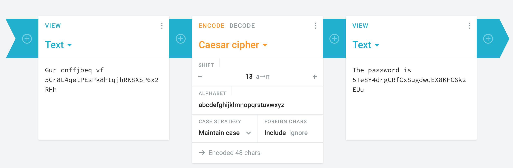
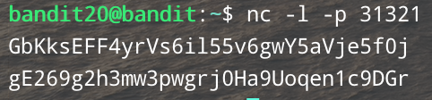
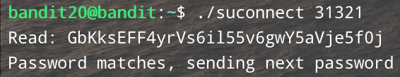
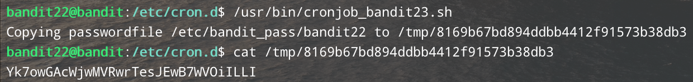
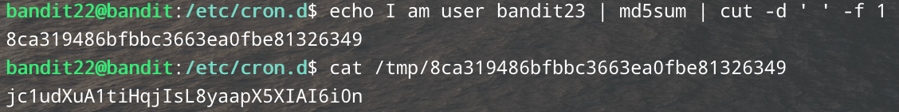
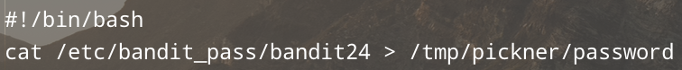
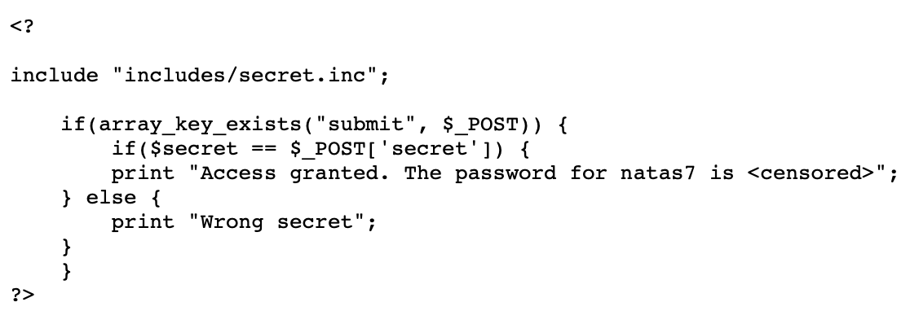
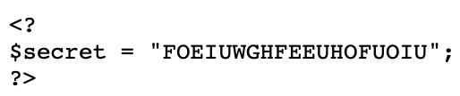
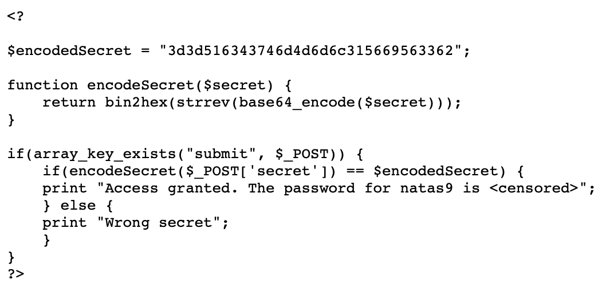
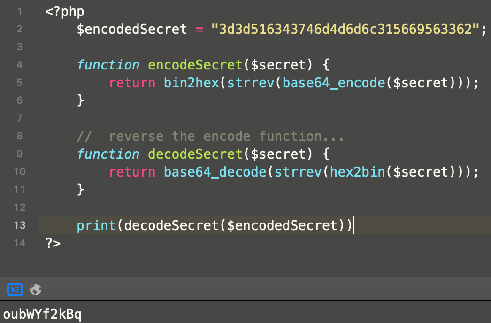

## PART 1:  (very basic linux exploits)

##### 0: bandit0
This password is arbitrarily given to us so we can start the *game*.

##### 1: boJ9jbbUNNfktd78OOpsqOltutMc3MY1
This password is located in a file called **readme** in the home directory, and because I assume we start in the home directory I use `ls -la` to see all the files and their permissions. Then I just tried to read the file using `cat readme`, and this worked because I was able to read the file and the password was indeed in it. Putting passwords in a file that anybody can see is a bad system to begin with so I'd argue it was broken before I got in.

##### 2: CV1DtqXWVFXTvM2F0k09SHz0YwRINYA9
Similar to problem 1, the password is located in a file but this time named **-**. I assured myself it was there using `ls -la` again, but had a tough time reading the file using `cat` at first. I tried putting the dash in quotes, and then decided to try `/-` before remembering that `./` refers to the current working directory so I tried `cat ./-` and I received the next password. This is also necessary so cat doesn't take the dash as the start of a flag. Again, this way of saving a password is broken to begin with because there are ways to see the file still.

##### 3: UmHadQclWmgdLOKQ3YNgjWxGoRMb5luK
Again, similar to problems 1 and 2, but the file names has spaces in its name and is helpfully named "spaces in this filename". I use `ls -la` as my sanity check and then I placed the filename in single quotes when reading it this time like so: `cat 'spaces in this filename'` and this worked. Very simple to extract, and yet again a broken way of storing a password...

##### 4: pIwrPrtPN36QITSp3EQaw936yaFoFgAB
The password is located in a hidden folder inside the inhere directory. First and foremost, I change directory into inhere like this: `cd inhere`. Luckily, my sanity check `ls -la` lists hidden files because of the `a` flag. Hidden files are denoted with a period in front of their name so I tried `cat .hidden` and this worked. This was relatively easy, and shows that even hidden files are secure from an adversary.

##### 5: koReBOKuIDDepwhWk7jZC0RTdopnAYKh
The file is the only human readable file inside of the inhere directory, in which there are 10 files from file "-file00" to file "-file09". I use `cd inhere` first to change into the correct directory. To check what an arbitrary non-human-readable file looks like I use `cat ./-file00` and it just garbage. So I use the `file` command on each and every file until I return *ASCII text* instead of *data*. I'm sure I could've written a script to do this but my bash skills aren't that sick yet.

##### 6: DXjZPULLxYr17uwoI01bNLQbtFemEgo7
So I figured the easiest way to do this challenge was to use the `find` command because I knew it was widely used to find files of a specific type. I was introduced in my Software Development class, but needed a refresher so I googled general usage and flags for the `find` command. I was delighted to be reminded that the function works recursively inside a directory. We used [this TecMint blog post](https://www.tecmint.com/35-practical-examples-of-linux-find-command/) to help remember the command's power. Size was the first thing attempted, and 1033 bytes is represented as 1033c so the full command used is: `find inhere -size 1033c` which yields the correct password. I broke the system because simply by knowing a few characteristics of the file in question, I was able to locate it rather simply.

##### 7: HKBPTKQnIay4Fw76bEy8PVxKEDQRKTzs
Similar to the above challenge, except this time the file we need is 33 bytes, is owned by the user bandit7 and the group bandit6 and is located *somewhere on the server*. In previous rounds I did some snooping and came across the `/` directory. This will come in handy later on... Initially, I thought the command would be: `find ~ -user bandit7 -group bandit6 -size 33c`, but this didn't return anything. I briefly googled why the tilde wasnt working, and stumbled across using the tilde with a slash like: `~/`. I hit a roadblock and didn't know what to do, so I tried just the slash because I literally ran the command with a tilde a million times wondering why it wasn't working. The period and the period with the slash also work (verified later). The working command is any of the following: `find / -user bandit7 -group bandit6 -size 33c`,
`find . -user bandit7 -group bandit6 -size 33c`, or `find ./ -user bandit7 -group bandit6 -size 33c`. this returns a lot of lines with Permission denied or No such file or directory, but one line (which is our winner) is: `./var/lib/dpkg/info/bandit7.password`. So I finally was able to obtain the password by using `cat ./var/lib/dpkg/info/bandit7.password`.

##### 8: cvX2JJa4CFALtqS87jk27qwqGhBM9plV
I used `ls -la` as my sanity check first once again, and I remember grep quite well from my Software Development days so this one was simply `grep 'millionth' data.txt` which gives us the password next to the word *millionth* as specified.

##### 9: UsvVyFSfZZWbi6wgC7dAFyFuR6jQQUhR
I originally tried to use `uniq -u data.txt` but every line is returned so it was obvious I didn't understand how the `uniq` command worked under the hood so I had to do some investigating. I found [this simple yet awesome source](https://discuss.codecademy.com/t/why-does-the-uniq-function-only-work-for-adjacent-lines/404583) to be the most helpful in both solving the problem at hand, and refreshing what the linux/unix philosophy is all about. I would first need to `sort` the file and then run `uniq -u`, so the final command looks like this: `sort data.txt | uniq -u`. Computers are great at simple tasks like sorting and comparing lines, so this is not a very secure method of obscuring one's password.

##### 10: truKLdjsbJ5g7yyJ2X2R0o3a5HQJFuLk
So this one was rather simple from my perspective, we were able to use `cat data.txt` and find the password rather quickly. I'll link an image to the output we received on my system, but in short the password is located near the end of the file and the string of equal signs was at the top of my screen with the password, so I tried it and it worked.

##### 11: IFukwKGsFW8MOq3IRFqrxE1hxTNEbUPR
So we are given a file `data.txt` which contains the password but it is within a base64 encoded string. Neither of us had much experience with base64, so we googled its usage. Luckily, this is a rather simple command and `base64 -d data.txt` worked perfectly. The `-d` flag denotes decode in this case. Known that our data was somehow linked to base64, it was rather simple to get the data back in a human readable form.

##### 12: 5Te8Y4drgCRfCx8ugdwuEX8KFC6k2EUu
I used `ls -la` as my sanity check, and then `cat data.txt` to see what we were working with (and for use later). We know the text is encoded with a caesar cipher and we also know the shift length, and although there are commands to break this cipher, a smart hacker knows of [cyptii.com](cryptii.com) for simple tasks such as this. Inputted into their website with a shift length of 13, we get the password. A photo of what the site looks like will be shown below.

##### 13: 8ZjyCRiBWFYkneahHwxCv3wb2a1ORpYL
We didn't really have a clue on how to finish this level. We realized quickly that `file` would be our friend, but we also had research to do on `tar`, `gzip`, and `bzip2`. Lastly, we were confused by the hexdump at first too. We used `xxd -r` to reverse the hexdump. On which, we could run file on. We have to unarchive a `tar`, then `bzip2`, then back to `tar`, then back to `bzip2`, then finally a `gzip` until the password file is in plain ASCII text. Overall, lots of transitioning between the compression types. This level took several tries to set up properly and took us quite a long time to finally solve. It was imperative to start with an empty directory to avoid confusion.

##### 14: 4wcYUJFw0k0XLShlDzztnTBHiqxU3b3e
I wasn't entirely sure how SSH worked going into this project so I had to do some research to get these games up and running.  Luckily I came across the `-i` flag which indicates the `identity_file` aka the private key. Initially, I use my sanity check to see what files we have and we only have `sshkey.private`. Also, because we are already on the server as bandit13, and the problem reminds us of localhost, I simply tried the command `ssh -i sshkey.private bandit14@localhost`. I had to type `yes`, but then we were in the system. From here, we are told where the password is, just that we need to access it as bandit14. Now that we are bandit14, we can simply run: `cat /etc/bandit_pass/bandit14` to get the password.

##### 15: BfMYroe26WYalil77FoDi9qh59eK5xNr
This one presented some difficulty because I thought we would be using the `ssh` command. This was going nowhere though, so we looked through some of the other commands that are listed on the OverTheWire. Again, lacking experience with many of the commands we turned to Google (and this literally can't be against honor code because when are we supposed to pick these up during the course of the class???) `nc` jumped out because I knew we probably wouldn't need anything involving SSL, although I wasn't sure how to supply it with the password for the previous level. Again, Google helped us out and it turned out we were missing the `echo` part. Our first attempt was lacking the `echo` because we found an example using `cat`. Then, we realized that `cat` prints the contents to the terminal, so if we wanted the password to follow this same behavior we'd have to use `echo`. Oddly enough, we didn't even think to use this command: `cat /etc/bandit_pass/bandit14 | nc localhost 30001`, but instead struggled to finally arrive at `echo 4wcYUJFw0k0XLShlDzztnTBHiqxU3b3e | nc localhost 30001`. Essentially, `nc` works like so: `nc <ip number> <port number>`, so this was a fairly straight forward once we added the `echo`.

##### 16: cluFn7wTiGryunymYOu4RcffSxQluehd
So we know the range of ports we are supposed to submit the current password to on localhost. I know that `nmap` would be useful here, especially with the `-p` port flag. `nmap -p 31000-32000` gets us a lot of output, and we can immediately see two ports jump out at us: 31518 and 31790. We also know that the port must speak SSL, and the only port that speaks SSL is 31790 so this is our port. Now we must submit the password for the current level to this port on localhost. To do this, we must use `openssl s_client`. Out whole command looked like so: `openssl s_client -connect localhost:31790 -quiet`, but instead of receiving the password we have received an RSA private key. We must send this using SSH much like we do for level 13. I create a temp directory in `/tmp` where I can save the RSA private key to, and then I call `ssh -i /tmp/temp_folder/b16key.private bandit17@localhost` to actually send this private key to the server using SSH. From here, since we are in the system as user bandit17, we can simply use `cat /etc/bandit_pass/bandit17` to see the password for the ext level.

##### 17: xLYVMN9WE5zQ5vHacb0sZEVqbrp7nBTn
We are told that there are two identical files, except one line is changed in passwords.new from passwords.old and is the password for the next level. Simply using `diff`, we could tell the line that is was changed in passwords.new rather simply: `diff passwords.new passwords.old`. Because we put passwords.new first, the first line of output from this command happens to be our password!

##### 18: kfBf3eYk5BPBRzwjqutbbfE887SVc5Yd
Because we had no idea where else to look, we checked the man pages for our `ssh` command and found that we can simply append commands to the end of our `ssh` command, which quickly and simply gave us the working command of: `ssh bandit18@bandit.labs.overthewire.org cat readme`.

##### 19: IueksS7Ubh8G3DCwVzrTd8rAVOwq3M5x
We are told that we're given an executable. We are also told to run the program with no arguments to see what the program does. We are also told that the passwords are in there usual spots `etc/bandit_pass/banditXX`. So after running `ls -la` to figure out what were dealing with, we ran the program `./bandit20-do` and figured out that we could run any command as user bandit20. Thus, the final command that provided the password is: `./bandit20 cat etc/bandit_pass/bandit20`. Again, much like the last two levels, we happened to be familiar with the commands either from previous challenges or courses.

##### 20: GbKksEFF4yrVs6il55v6gwY5aVje5f0j
This level proved to be quite difficult as we really didn't have much of a clue where to start. We figured we'd start by googling the **NOTE**, and figured out we needed to read up on TCP. After a while of making literally no progress, we realized (through online help, again, we really have no idea how we would have keyboard smashed our way to getting this one with **NO** external resources...???) We figured out we had to use `nc` and port 31321 and create a TCP listener after a solid 2 hours of frustration and confusion. We created this using the command `nc -l -p 31321`. The `-l` flag is what enables us to create the listener. But we still need another SSH session, and we could have done this a few ways, but we decided to just use another tab in our terminal window and create a whole new session. Once we initialized our listener, we copied and pasted the password for level 20 and hit enter to *send* this along. We used our other terminal tab to run the command: `suconnect 31321`, and the next password is sent back to our first terminal window. I'll provide pictures of what this looked like on both screens at the end.

##### 21: gE269g2h3mw3pwgrj0Ha9Uoqen1c9DGr
So right off the bat, we `cd` into `/etc/cron.d/`, and then list the files (`ls -la`). We see a file titled `cronjob_bandit22` and use `cat` to read it. From here we notice a shell script being called from within it. The shell script changes the permissions on a seemingly random file in the `/tmp` directory, and then the script puts the contents of `/etc/bandit_pass/bandit22` into the seemingly random file from before. We simply thought to look at that file, and it turns out the password for 22 is in fact in that file.

##### 22: Yk7owGAcWjwMVRwrTesJEwB7WVOiILLI
Incredibly similar to the previous problem, except instead of arbitrarily doing it for the current level, it uses a `whoami` command to create the hash that we store the password for whatever user we supply it with. I will show the output if we simply run `cronjob_bandit23`, as well as the chain of commands that give us the correct answer (*Note:* these commands are copied and pasted from the cronjob script.) Since we see the `md5sum` command being fed the `whoami` command in the script, we thought we could simply run the same command but supply it with the correct user we'd have the right hash and then we could just use `cat` to read that file. We were 100% correct in our reasoning here. We basically had a lucky hunch that the script was just hashing a new file name to store the password in. Also the script was definitely really easy to navigate.

##### 23: jc1udXuA1tiHqjIsL8yaapX5XIAI6i0n
So for this one were instructed to write our own shell script. We both had some experience doing this, but it would take us a little while to get the script to run. We knew that we would use `chmod` at least once, because we were going to be writing and editing our script in one place, and moving it over to `/var/spool/bandit24` where it would be run and then deleted. We started by creating a shell script and a regular file to hold the password and placed those in a temp folder (on my system: `/tmp/pickner/`). The script is rather simple, and I will be adding a picture of it to the end. Now was where we were getting stuck having to restart. We had to allow the password file to be readable and writeable, and the script had to be executable, so we could use `chmod 666` on the password file and `chmod 777` on the script. We figured out that now it was possible to move the script into `/var/spool/bandit24` and when we did (using: `cp getpass.sh /var/spool/bandit24/`). Finally, using `cat password` we have the password for the next level.

##### 24: UoMYTrfrBFHyQXmg6gzctqAwOmw1IohZ
This problem involves brute-forcing a 4 digit passcode along with the password for the previous level. Obviously we could try each one by hand, but we figured some sort of script would be way simpler and quicker. Although many languages would work fine here, we figured a shell script would be the easiest because what we have to solve now is very similar to level 15. Our script initially called `nc` on each iteration of the for loop. We changed this to create a file with the password and unique pincode on each line and then using: `cat` with the file and the `nc` command.

##### 25: uNG9O58gUE7snukf3bvZ0rxhtnjzSGzG
Once again, google was used obviously. Having literally no experience with anything this problem says (Not bash...?), google helped us understand the `more` command, and also helped us understand how to not get booted from this level immediately. After a solid hour trying a bunch of random things that didn't work, we made our terminal small and we didn't get booted. Luckily, learning more about the `more` command helped us open up a file in vim. We weren't familiar with vim at all so we did some googling on it as well. We quickly figured out we could open any other file in vim, which allowed us to open `/etc/bandit_pass/bandit26` which provides the password.

##### 26: 5czgV9L3Xx8JPOyRbXh6lQbmIOWvPT6Z
##### 27:
##### 28:
##### 29:
##### 30:
##### 31:
##### 32:
##### 33:
##### 34:
##### 35:

## PART 2: (general web exploits)

##### 0: natas0
Again, this password is arbitrarily given to us so we can start the *game*.

##### 1: gtVrDuiDfck831PqWsLEZy5gyDz1clto
The password is simply in an HTML comment, so you just need to right click on the page, check the page source, and do a little digging. HTML comments are obviously a bad place to store sensitive information because those comments can be seen client side.

##### 2: ZluruAthQk7Q2MqmDeTiUij2ZvWy2mBi
Same exact scenario as above except right-clicking is disabled so the web inspector must be opened via keyboard shortcut or using the menu bar at the top. I typically right-click so this was an opportunity to learn the keyboard shortcut as I used the menu bar at the top.

##### 3: sJIJNW6ucpu6HPZ1ZAchaDtwd7oGrD14
Similarly to problems 1 and 2, we checked the page source and found an image stored on the server at `files/`. This one wouldn't be quite as simple as 1 or 2, but we checked what was on the site if we navigated to `/files` and we came across a file named `user.txt`. We checked this file and sure enough the password was located in it. Rather quick and simple.

##### 4: Z9tkRkWmpt9Qr7XrR5jWRkgOU901swEZ
I followed the same steps as above, but was really stumped. *Until* we checked the write-up and remembered robots.txt was intended for web crawlers to function properly. I checked robots.txt, which has a single disallow of the directory `/s3cr3t/` which sure enough is where users.txt is located, and sure enough the password is located in this file.

##### 5: iX6IOfmpN7AYOQGPwtn3fXpbaJVJcHfq
This level required the use of Burp Suite which we found to be difficult to navigate. We knew from looking at the request to the homepage and the request to index.php that the HTTP request for the index.php page has a header titled `referer` which is the parameter that should be edited from natas4 to natas5. We had no trouble with this part, but it was actually finding the password that was tricky. Eventually after giving up and coming back to the problem, we found the response tab which actually housed the response (and the password) from our edited request. Essentially, we just needed to change a header in the HTTP request, and our in-familiarity with BurpSuite was clear.

##### 6: aGoY4q2Dc6MgDq4oL4YtoKtyAg9PeHa1
Similar to problem 5, we were required to look at the request in Burp Suite. Upon quick review of the request, we were able to see that a cookie is associated with logging in. We changed the cookie to be `loggedin=1`, and then looked at the response (last problem helped with this) the password is easily found. By hijacking the cookies, we appeared to be authenticated.

##### 7: 7z3hEENjQtflzgnT29q7wAvMNfZdh0i9
This level prompts us to enter a secret and a link to view the page source. Since we obviously didn't know the secret yet, we checked the page source and saw some php in there that probably holds the secret. The php includes a file so we just need to navigate to this file. Luckily the path is found on the page source (`includes/secret.inc`), and the secret is in fact in this file. I will share a screen grab of the page source containing the php and the file that is included in the php. Once the secret is inputted into the box the password is shown.

##### 8: DBfUBfqQG69KvJvJ1iAbMoIpwSNQ9bWe
This problem has two links on the landing page, one titled `Home` and the other `About`. Luckily, there is also a hint on the landing page hidden in an HTML comment and it says that we can find the password at: `/etc/natas_webpass/natas8`. We initially tried `http://natas7.natas.labs.overthewire.org/etc/natas_webpass/natas8`, but upon clicking either of the links, we see that the URL changes to: `http://natas7.natas.labs.overthewire.org/index.php?page=home`, and includes the index.php part... We figured the path that was given to us earlier may be linked to the php somehow so we tried: `http://natas7.natas.labs.overthewire.org/index.php?page=/etc/natas_webpass/natas8` on a whim, and it worked! This stuff is finally seeming a little more intuitive (or we just got sorta lucky).

##### 9: W0mMhUcRRnG8dcghE4qvk3JA9lGt8nDl
We are given a link to view the source code (I will include a photo of this below). The source code is some php which is begging to be reverse engineered. Luckily I have access to CodeRunner so this was an incredibly simple task, I will also share a picture of my code below. The PHP code takes an inputted secret, does some things to it, and checks to see if it matches the encoded secret. I reverse engineered the function that takes our input so we could just input the encoded secret and get our answer. Once we input this *answer*, we get the password for the next level.

##### 10: nOpp1igQAkUzaI1GUUjzn1bFVj7xCNzu
We used the hint from level 8 and our knowledge that the password is stored in `/etc/natas_webpass/natasXX`. The source code uses command line `grep` to look through a dictionary file. Because we knew that `.*` would do this, we just replaced the semicolon in our last level's command with `.*` and we found our password.

##### 11: U82q5TCMMQ9xuFoI3dYX61s7OZD9JKoK

## PART 3: (general web exploits)

## PART 4: (A real challenge)
#### Andrew Pickner's ID: c12fb975-52ff-436f-a851-1046ae1ac9c6

#### Input Validation
##### 1: SQL Login
##### 2: Cross-Site Scripting
##### 3: SQL Credit Cards

#### Input Validation
##### 1: Stack Overflow
